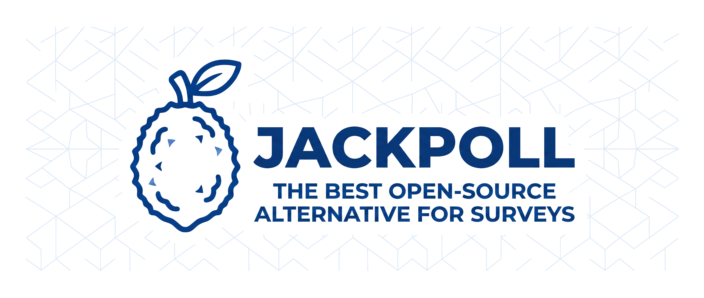
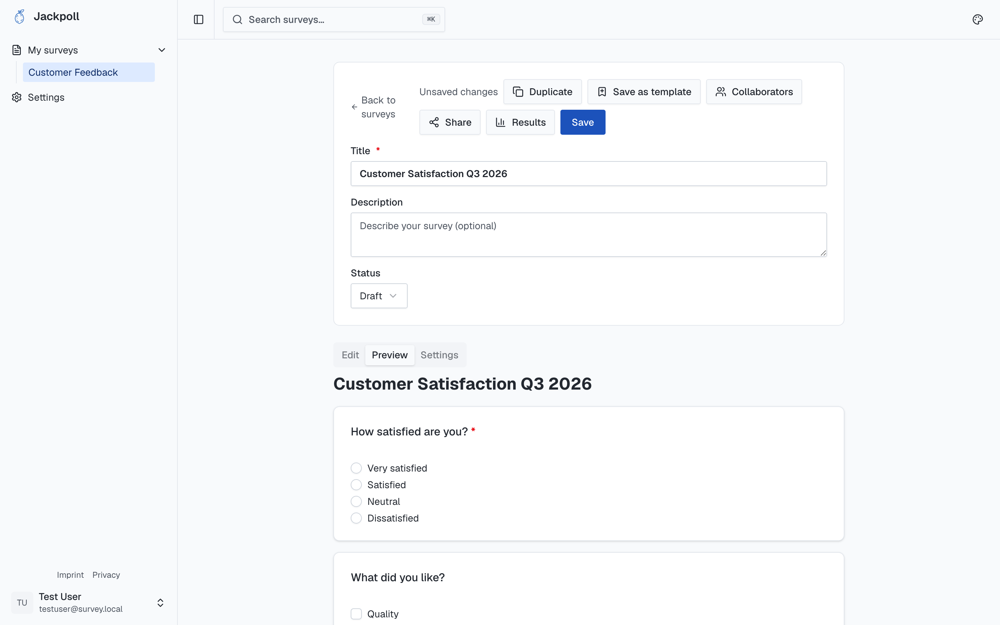
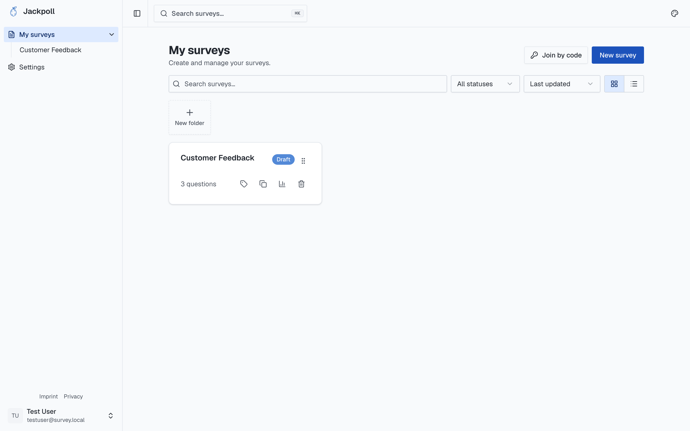

<p align="center">
  
</p>

<p align="center">
  
  
  
</p>

<p align="center">
  <b>Jackpoll — an open-source tool to build, share and analyze surveys and quizzes.</b>
</p>

<p align="center">
  <a href="apps/frontend">Frontend</a> ·
  <a href="apps/backend">Backend</a> ·
  <a href="https://github.com/jackpoll-org/jackpoll-selfhost"><b>🚀 Self-hosting</b></a> ·
  <a href="https://jackpoll.org">Website</a>
</p>

---

This is the **Jackpoll monorepo**: the web/mobile frontend and the API backend in one place.

```
jackpoll/
├── apps/
│   ├── frontend/   Next.js web app + Capacitor iOS/Android  (see apps/frontend/README.md)
│   └── backend/    Quarkus REST API                          (see apps/backend/README.md)
├── .github/workflows/   CI: image publish, E2E, mobile, migrations
└── docs/assets/         Shared brand assets
```

Self-hosting configuration (Docker Compose / Swarm stacks) lives in its own repo:
**[jackpoll-org/jackpoll-selfhost](https://github.com/jackpoll-org/jackpoll-selfhost)**.

## Screenshots

| Build | Preview |
|---|---|
|  |  |
|  |  |

## Tech stack

| | Frontend | Backend |
|---|---|---|
| Language | TypeScript | Java 21 |
| Framework | Next.js + Capacitor | Quarkus 3.35 |
| Package/build | pnpm | Maven (`./mvnw`) |
| Data | — | PostgreSQL, MinIO, Keycloak, Redis |

## Quick start (development)

Run the backend and frontend in two terminals.

```bash
# Backend — infra + API (from apps/backend)
cd apps/backend
docker compose up -d          # Postgres, MinIO, Keycloak, Redis, Mailpit
./mvnw quarkus:dev            # API on http://localhost:8080

# Frontend — web app (from apps/frontend)
cd apps/frontend
pnpm install
pnpm dev                      # app on http://localhost:3000
```

See each app's own README for details: [apps/frontend/README.md](apps/frontend/README.md) · [apps/backend/README.md](apps/backend/README.md).

## Images

CI publishes production images to GHCR under the org:

- `ghcr.io/jackpoll-org/frontend`
- `ghcr.io/jackpoll-org/backend`

These are what the [self-host stacks](https://github.com/jackpoll-org/jackpoll-selfhost) pull.

## License

MIT.
