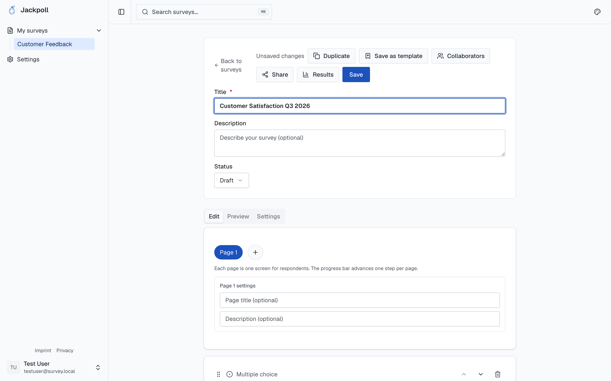
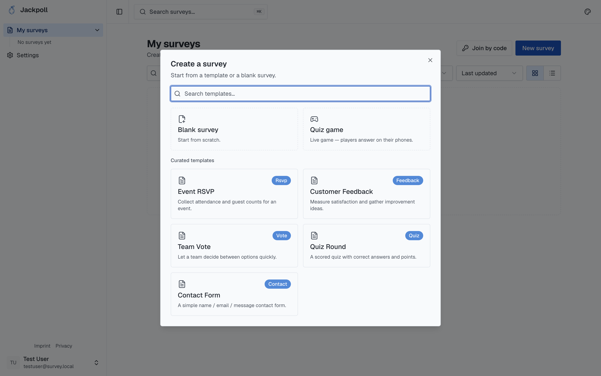
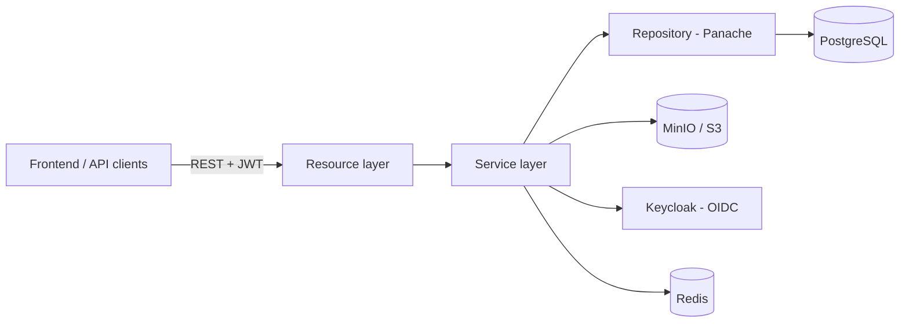

<p align="center">
  
</p>

<p align="center">
  
  
  
  
  
</p>

<p align="center">
  <b>Backend API for Jackpoll — an open-source tool to build, share and analyze surveys and quizzes.</b>
</p>

<p align="center">
  <a href="https://github.com/jackpoll-org/jackpoll-selfhost"><b>🚀 Self-hosting</b></a> ·
  <a href="../frontend">Frontend</a> ·
  <a href="https://jackpoll.org">Website</a> ·
  <a href="#quick-start">Quick start</a>
</p>

---

## Contents

- [Screenshots](#screenshots)
- [Features](#features)
- [Tech stack](#tech-stack)
- [Architecture](#architecture)
- [Quick start](#quick-start)
- [Self-hosting](#self-hosting)
- [Testing & build](#testing--build)
- [Frontend sync](#frontend-sync)
- [License](#license)

## Screenshots

| Build | Preview |
|---|---|
|  |  |
| **Drag-and-drop builder** with pages, question types and logic. | **Live preview** of the respondent experience. |
|  |  |
| **Templates** to start fast — feedback, quiz, RSVP and more. | **Dashboard** to organize, search and manage surveys. |

## Features

- **Auth** — registration, login/logout, JWT sessions, roles (Admin/Editor/Viewer), email verification and password reset via one-time codes, BCrypt hashing.
- **Survey API** — CRUD for surveys; question types (short answer, multiple choice, checkboxes, dropdown, grid); server-side answer validation; conditional follow-up logic; image upload via presigned URLs.
- **Quiz mode** — correct answers, scoring, automatic grading and result statistics.
- **Collaboration** — invite collaborators by email, role-based access control (RBAC), per-survey permissions.
- **Sharing & embedding** — public survey links, iframe-friendly embed endpoints, CORS configured for the frontend origin.
- **Analytics** — store and fetch responses, aggregation endpoints for charts, CSV export, quiz statistics.

## Tech stack

| | |
|---|---|
| **Framework** | [Quarkus](https://quarkus.io/) 3.35 |
| **Language** | Java 21 |
| **REST** | Jakarta REST (JAX-RS) via `quarkus-rest` |
| **Security** | Quarkus Security + JWT, Keycloak (OIDC) |
| **Data** | PostgreSQL + Hibernate/Panache, Flyway migrations |
| **Storage** | MinIO / S3 (presigned uploads) |
| **Infra** | Redis (rate limiting), Mailpit/SMTP (email), optional ClamAV |
| **Build** | Maven (`./mvnw` wrapper included) |
| **Testing** | JUnit 5 + REST Assured |

## Architecture

A conventional layered design — REST resources delegate to services, which use Panache repositories for data access. DTOs form the API contract shared with the frontend.



1. **Resource layer** — REST endpoints, request/response mapping, no business logic.
2. **Service layer** — validation, orchestration, transactions.
3. **Repository layer** — database access with Panache.
4. **DTO layer** — API contracts, kept in sync with the frontend TypeScript interfaces.

## Quick start

Requirements: **Java 21**, **Docker** (for local infra), and Maven (or the bundled `./mvnw`).

```bash
# 1. Start local infra (Postgres, MinIO, Keycloak, Redis, Mailpit)
docker compose up -d

# 2. Run the backend in dev mode
./mvnw quarkus:dev
```

- API: <http://localhost:8080>
- Dev UI: <http://localhost:8080/q/dev/>
- Health: <http://localhost:8080/q/health>

Copy `.env.example` to `.env` to adjust local configuration. See the comments in `.env.example` for every setting.

## Self-hosting

Want to run your own Jackpoll instance? Everything you need — Docker Compose / Swarm stacks, environment templates, the Keycloak realm and a step-by-step guide — lives in a dedicated repo:

> ### 👉 [github.com/jackpoll-org/jackpoll-selfhost](https://github.com/jackpoll-org/jackpoll-selfhost)

It covers two paths:

- **Single host** — plain `docker compose up -d`, published ports, ideal for trials and small instances.
- **Docker Swarm + Traefik** — multi-replica with automatic TLS and external secrets for production.

The backend and frontend production images are published to GHCR:
`ghcr.io/jackpoll-org/backend` · `ghcr.io/jackpoll-org/frontend`.

## Testing & build

```bash
./mvnw test                       # run tests
./mvnw package                    # build → target/quarkus-app/
docker build -f Dockerfile -t survey-backend .   # container image
```

Database schema is managed by Flyway — migrations run automatically on startup; Hibernate only validates in production.

## Frontend sync

This backend is developed **in parallel with the frontend** (`apps/frontend`). API contracts, types and behavior must match on both sides before a feature is considered done.

- Coordinate endpoint / DTO changes with the frontend.
- Keep DTO field names aligned with the frontend TypeScript interfaces.
- In dev, CORS is configured for `http://localhost:3000`.

## License

MIT.

## Inspiration

The feature set draws on publicly documented capabilities of common form tools — form building, quiz functionality, collaboration and graphical response analysis.
